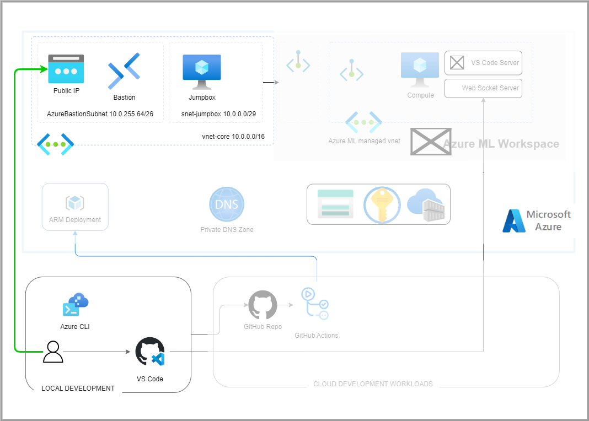

# Demo Azure ML Studio with VS Code

This project demonstrates how to connect VS Code to Azure ML Studio and run a simple experiment.

## Architecture Diagram




## Create System Identities

The solution uses several system identities.

| System Identities        | Authentication                                             | Authorization                                                                                                                     | Purpose                                                                             |
| ------------------------ | ---------------------------------------------------------- | --------------------------------------------------------------------------------------------------------------------------------- | ----------------------------------------------------------------------------------- |
| `env.AZURE_CLIENT_ID` | [EnvironmentCredential](https://github.com/Azure/azure-sdk-for-python/blob/main/sdk/identity/azure-identity/TROUBLESHOOTING.md#troubleshoot-environmentcredential-authentication-issues)       | <ul><li>TBD</li></ul>  |  Manage the ml workspace resources and jobs.  |

```bash
# Configure the environment variables. Copy `example.env` to `.env` and update the values
cp example.env .env

# load .env vars (optional)
[ ! -f .env ] || eval "export $(grep -v '^#' .env | xargs)"
# or this version allows variable substitution and quoted long values
[ -f .env ] && while IFS= read -r line; do [[ $line =~ ^[^#]*= ]] && eval "export $line"; done < .env

# Login to cloud cli. Only required once per install.
az login --tenant $AZURE_TENANT_ID
az account set --subscription $SUBSCRIPTION_ID
# Create Azure ML App client identity
# ./scripts/create_app_sp.sh --name "$APP_NAME"

```

## Provision Resources

The project uses scripts and GitHub Actions to provision resources. Each Github Action calls a specific script. The following table lists the workflows and their purpose.

| Workflow	                    | Description |
| ----------------------------- | ----------- |
| platform_connectivity_core	| Provision and manage core connectivity resources. |
| platform_common_services      | Provision and manage common resources. |

Run platform_connectivity_core workflow to create core vnets, subnets, and peering. This is equivalent to calling the following:
```bash
./script/devops.sh provision_core_connectivity --location "$location" --jumpbox
```

Run platform_common_services workflow to create common resources. This is equivalent to calling the following:
```bash
./script/devops.sh provision_common_services --location "$location" --admin-username "$admin_username" --admin-password "$admin_password" --jumpbox 
```

## Provision Local Data

```bash
# Download the example data.
mkdir ./data
cd ./data
wget https://azuremlexamples.blob.core.windows.net/datasets/credit_card/default_of_credit_card_clients.csv
```

# Architecture Decisions

Network Isolation: Use the [managed network - only approved outbound mode](https://learn.microsoft.com/en-us/azure/machine-learning/how-to-network-isolation-planning?view=azureml-api-2#allow-only-approved-outbound-mode) pattern.


# References
* Tutorial - Secure Workspace https://learn.microsoft.com/en-us/azure/machine-learning/tutorial-create-secure-workspace?view=azureml-api-2
* Plan for Network Isolation https://learn.microsoft.com/en-us/azure/machine-learning/how-to-network-isolation-planning?view=azureml-api-2